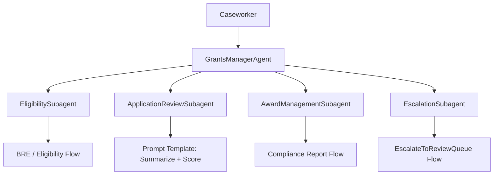
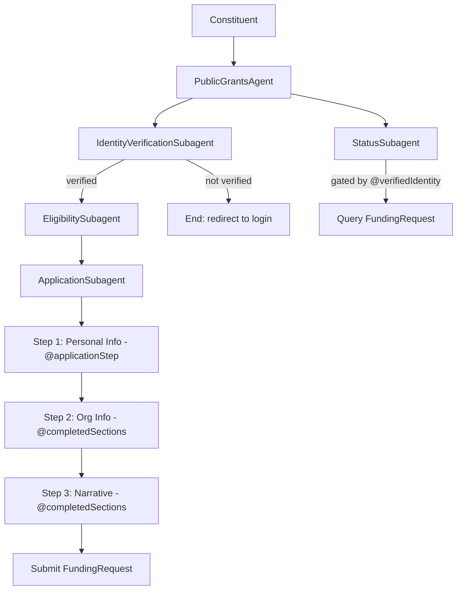

# Agent Types and Deployment Patterns

## Decision Table

| End User | Primary Lifecycle Stage | Recommended Pattern |
|---|---|---|
| Caseworker / Grants Manager | Review & scoring, Award & disbursement | Employee-Facing |
| Program Officer | All stages — oversight | Employee-Facing |
| Automated record processing | Any stage triggered by record change | Workflow/Automation |
| Constituent / Applicant | Eligibility, intake, status tracking | Service/Public-Facing |
| Both internal + external | Eligibility → review → award | Dual: Employee + Service agents |

---

## Pattern 1: Employee-Facing Agent

**Best for:** Caseworkers reviewing applications, grants managers making decisions, program officers monitoring compliance.

**Subagent graph:**
```
GrantsManagerAgent (orchestrator)
  ├── EligibilitySubagent       — Check eligibility, recommend programs
  ├── ApplicationReviewSubagent — Summarize application, score against criteria, review status
  ├── AwardManagementSubagent   — Track awards, compliance reporting, budget utilization
  └── EscalationSubagent        — Flag fraud, complex cases, create escalation Case
```

**Key characteristics:**
- Users are authenticated Salesforce users — no Verification Gate needed
- Can read/write all FundingRequest, GrantApplicationReview, FundingAward records
- Prompt Template actions (Summarize, Score) are highest-value here
- Decision Explainer output surfaced inline

**Deployment:** Einstein Bot (NGA or legacy) embedded in Salesforce console. Permission set: Grantmaking Manager or Grantmaking User.

---

## Pattern 2: Workflow / Automation Agent

**Best for:** Record-triggered automation — new application submitted, review completed, award approved, compliance report due.

**Subagent graph:**
```
WorkflowOrchestrator
  ├── SubmissionProcessor       — Validate required docs, check for duplicates, set eligibility
  ├── ReviewNotifier            — Assign reviewers, send notifications, track completion
  ├── AwardProcessor            — Generate award letter (DocGen), update status, notify applicant
  └── ComplianceMonitor         — Check budget utilization, flag at-risk awards, send reminders
```

**Key characteristics:**
- Triggered by Platform Events or Flow → Agent invocation (not user-initiated)
- No conversational turn — executes actions and exits
- Primarily FLOW and STANDARD actions
- No ADL knowledge grounding needed in most cases

**Deployment:** Autolaunched via Record-Triggered Flow or Platform Event trigger. No UI embedding needed.

---

## Pattern 3: Service / Public-Facing Agent

**Best for:** Constituents checking eligibility, completing applications, tracking status via Experience Cloud.

**Subagent graph:**
```
PublicGrantsAgent (orchestrator)
  ├── IdentityVerificationSubagent  — Verify constituent identity (REQUIRED FIRST)
  ├── EligibilitySubagent           — Check eligibility, recommend programs
  ├── ApplicationSubagent           — Guide application completion (stateful multi-turn)
  ├── StatusSubagent                — Track application status (gated by auth)
  └── FAQSubagent                   — Answer program questions (ADL or Knowledge Articles)
```

**Key characteristics:**
- **Verification Gate is mandatory** before any constituent-data action — see [verification-gate-guide.md](verification-gate-guide.md)
- "Guide Application Completion" requires multi-turn state — see [multi-turn-state-guide.md](multi-turn-state-guide.md)
- ADL knowledge grounding strongly recommended for FAQ use case
- Escalation to caseworker (Case creation Flow) for complex eligibility edge cases
- Gov Cloud: legacy agent only — NGA not FedRAMP-authorized

**Deployment:** Einstein Bot embedded in Experience Cloud community site. Permission set: Experience Cloud for Grantmaking.

---

## Mermaid Diagrams

### Employee-Facing Subagent Flow


### Service Agent Auth + Application Flow

